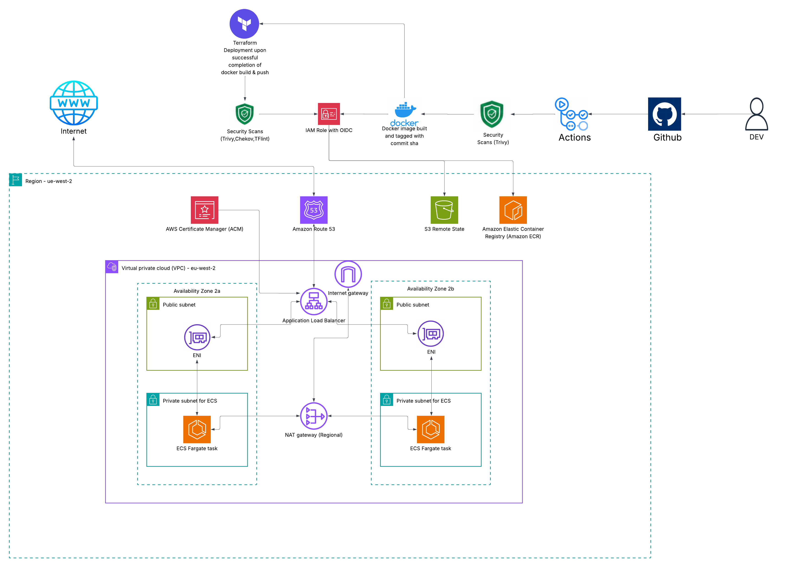
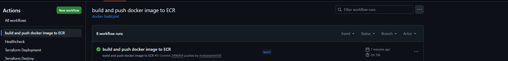
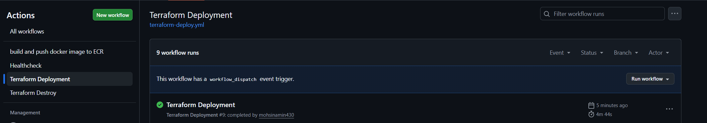
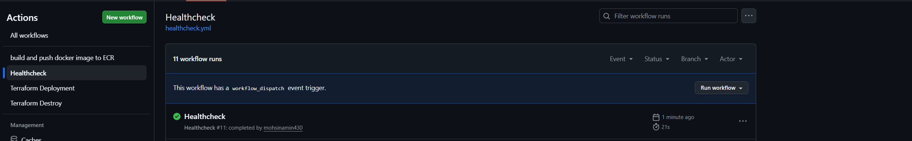

# ECS Threat Composer App Deployment

## Overview

This project deploys the Amazon Threat Composer application on Amazon ECS Fargate using Terraform. The infrastructure is provisioned using Infrastructure as Code and the deployment process is automated through GitHub Actions. The project demonstrates cloud networking, container deployment, CI/CD, and AWS security best practices.

---

## Architecture Diagram



---

## Repository Structure

```text
threat-composer/
├── .dockerignore
├── .gitignore
├── Dockerfile
├── README.md
├── .github/
│   └── workflows/
│       ├── docker-build.yml
│       ├── healthcheck.yml
│       ├── terraform-deploy.yml
│       └── terraform-destroy.yml
├── app/
├── bootstrap/
│   ├── main.tf
│   ├── provider.tf
│   └── modules/
│       ├── ecr/
│       └── s3/
└── infra/
    ├── main.tf
    ├── outputs.tf
    ├── provider.tf
    ├── variables.tf
    └── modules/
        ├── acm/
        ├── alb/
        ├── ecs/
        └── vpc/
```

---

## Prerequisites

Before deploying the project, ensure you have:

- An AWS account
- Terraform installed
- Docker installed
- AWS CLI configured
- A registered domain managed by Route 53
- Git installed


---
## Local Application Setup

Do the following commands:
```bash
yarn install
yarn build
yarn global add serve
serve -s build
```
Navigate to
```
http://localhost:3000
```

## Dockerfile
Multi-Stage Dockerfile using nginx to serve static content with a small image blueprint (~30mb). Non-root user for improved security 

## Infrastructure Components

### Networking

- VPC spanning two Availability Zones
- Public and private subnets
- Internet Gateway for public internet access
- Regional NAT Gateway for outbound internet access from private subnets

### Compute

- ECS Cluster running on Fargate
- ECS Service to maintain the desired task count
- Task Definition containing the application container

### Traffic Management

- Application Load Balancer
- Target Group for ECS tasks
- HTTP to HTTPS redirection
- ACM certificate for TLS encryption

### DNS

- Route 53 hosted zone
- Custom domain pointing to the Application Load Balancer

---

## Technologies Used

### Application

- Amazon Threat Composer

### Infrastructure

- AWS
- Terraform
- Amazon ECS Fargate
- Amazon VPC
- Application Load Balancer
- Amazon ECR
- Route 53
- AWS Certificate Manager

### CI/CD

- GitHub Actions
- GitHub OIDC
- Terraform CLI

### Security

- Checkov
- Trivy
- TFLint

---

## Infrastructure Setup

### Bootstrap

The bootstrap configuration creates the shared infrastructure required for Terraform.

- S3 bucket for remote state
- DynamoDB table for state locking
- Amazon ECR repository for container images

```bash
cd bootstrap
terraform init
terraform plan
terraform apply
```

### Deploy Infrastructure

Deploy the application infrastructure using Terraform. (Ensure bootstrap infra has been deployed first)

```bash
cd infra
terraform init
terraform plan 
terraform apply
```

Terraform provisions the networking, ECS cluster, load balancer, certificates, DNS records, and supporting resources.

---

## CI/CD Pipeline

### Build Workflow

The build workflow runs when application code is pushed.

It performs the following steps:

- Build the Docker image
- Scan the image with Trivy
- Push the image to Amazon ECR

### Deployment Workflow

The deployment workflow authenticates using GitHub OIDC and deploys the latest infrastructure changes.

The workflow:

- Assumes an AWS IAM role
- Runs Terraform plan
- Applies infrastructure changes
- Updates the ECS service
- Performs a health check after deployment

---

## AWS Infrastructure Details

### Networking

The application is deployed inside a VPC spanning two Availability Zones.

Public subnets host the Application Load Balancer while ECS tasks run inside private subnets. A regional NAT Gateway provides outbound internet access for the containers.

### Container Platform

The application runs as an ECS Fargate service.

Container images are stored in Amazon ECR and are updated automatically during deployment.

### Load Balancing

An internet facing Application Load Balancer distributes incoming traffic across ECS tasks.

HTTP requests are redirected to HTTPS using an ACM certificate.

### Domain

Route 53 manages DNS records for the application.

The custom domain resolves directly to the Application Load Balancer.

---

## Security

### Identity and Access Management

- GitHub OIDC for passwordless authentication
- Least privilege IAM roles
- ECS task execution role

### Container Security

- Trivy image scanning
- Private Amazon ECR repository

### Infrastructure Security

- Checkov Terraform scanning
- TFLint validation
- Security Groups controlling network access

---

## Challenges

Some challenges encountered during development included:
- Building Docker images with non root users in runner stage. Required nginxinc/nginx-unprivileged image
- ECS image pull failures from ECR. This was due to the default tag was set to "latest" in terraform variables. Resolved by passing github ref through workflow
- ACM certificate DNS validation
- GitHub OIDC permission issues

---

## Design Decisions

Key design choices include:

- ECS Fargate to avoid managing EC2 instances
- Terraform for repeatable infrastructure deployments
- GitHub Actions for automated CI/CD
- ALB for HTTPS termination and traffic routing
- Private subnets to improve application security

---

## Future Improvements

Potential enhancements include:

- ECS Auto Scaling
- CloudWatch dashboards and alarms
- Dev and Prod workspaces on Terraform
---

## Lessons Learned

This project improved my understanding of:

- Terraform modules
- AWS networking
- ECS Fargate deployments
- CI/CD with GitHub Actions
- IAM roles and GitHub OIDC
  
---

## Screenshots

### App Working


### Sucessful Workflows




